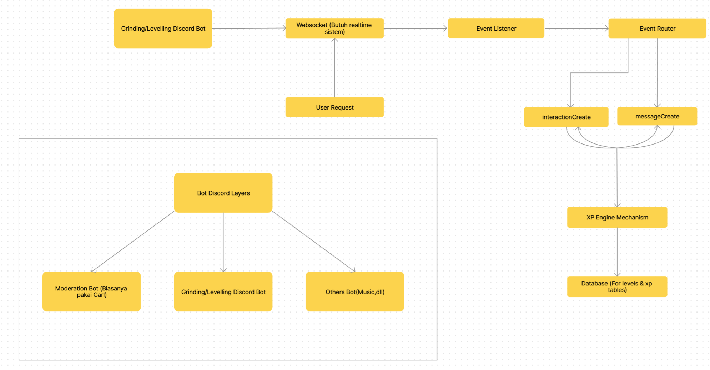

# Discord Leveling Bot

Bot Discord untuk sistem XP dan leveling per server. XP didapat otomatis dari aktivitas chat, disimpan di SQLite lokal.



## Fitur

- XP otomatis tiap pesan (50–100 XP, cooldown 60 detik per user per server)
- Notifikasi level up berupa embed + role reward opsional
- `/rank` — kartu rank: posisi di server, level, total pesan, progress bar XP
- `/leaderboard` — top 30 member paling aktif di server

## Setup

```bash
pnpm install
```

Buat file `.env`:

```env
BOT_TOKEN=token_bot_dari_developer_portal
CLIENT_ID=application_id
GUILD_ID=id_server_untuk_testing   # opsional, kosongkan untuk deploy global
```

Aktifkan **Message Content Intent** dan **Server Members Intent** di Discord Developer Portal.

Daftarkan slash command, lalu jalankan bot:

```bash
pnpm run deploy   # cukup sekali, atau tiap kali command berubah
pnpm start
```

`pnpm run check` menjalankan syntax check tanpa eksekusi.

## Struktur

```
src/
  index.js              # entry point, load command & event, handler interaction
  deploy-commands.js    # register slash command ke Discord API
  commands/             # slash command (auto-load, wajib export data + execute)
  events/               # event handler (auto-load, wajib export name + execute)
  utils/database.js     # koneksi SQLite + prepared statements
  utils/xpCalculator.js # rumus level dan XP
data/scores.db          # database (auto-generate, tidak di-commit)
```

## Rumus Level

```
xpForLevel(n) = 5n² + 50n + 100
```

Level naik saat total XP melewati akumulasi kebutuhan XP semua level sebelumnya.

## Database

SQLite via `better-sqlite3`, tabel tunggal `levels` dengan primary key `{guild_id}-{user_id}` sehingga data terpisah per server. Konfigurasi: WAL mode, `synchronous = NORMAL`, busy timeout 5 detik, cache 32 MB. Index `idx_guild_xp` mempercepat query leaderboard.

## Role Reward

Edit map `Role_Rewards` di `src/events/messageCreate.js`, ganti placeholder dengan role ID asli:

```js
const Role_Rewards = {
    5: '123456789012345678',
    10: '...',
};
```

Selama masih placeholder (`Role_Id_*`), assign role dilewati.

## Catatan

`data/scores.js` berisi command `/score` yang belum aktif karena tidak berada di `src/commands/`. Pindahkan ke sana agar ikut ter-load.

## Referensi

- [SQLite Write-Ahead Logging](https://sqlite.org/wal.html)
- [SQLite PRAGMA](https://sqlite.org/pragma.html)
- [discord.js Guide](https://discordjs.guide/)

## Lisensi

MIT — lihat [LICENSE](LICENSE).
